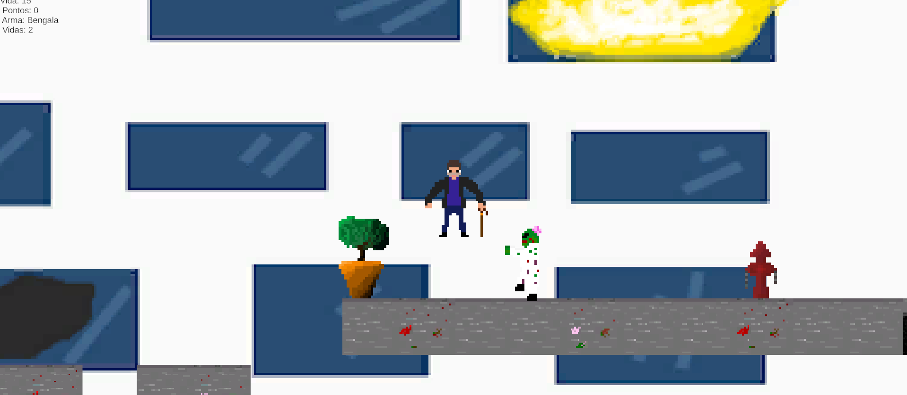

# (2D Game) Doctor Home

Simple 2D Platform game made with the Unity Game Engine for my "Programming for Games" discipline, where we were tasked to drawn and animate a Player, an enemy, the map and some collectibles, some scripts such as Health System, the Death Zone, Damaging, Enemy Movements were given us by the teacher, but things such as the Game Controller, how the collectibles would work, handling extra animations, and other stuff that we decided to do, we would have to build the scripts on our own.

Despite the small deadline, the results were satisfactory. (I also finished the discipline with max grade)

The game is inspired by the House MD series, where the Player, dr. Home must flee from a horde of zombies, using Vicodin to heal, calculating the right time to do jumps as Home cannot jump with ease and using the flashlight to instakill Zombies with an epilepsy attack.

